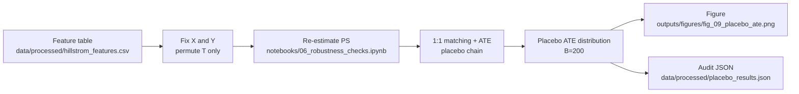

# Phase 4 Execution Report

本报告记录 Phase 4 的实际实现、可核验证据与主要结论，供仓库审阅、项目归档和后续复现参考。文中仅引用可在仓库中直接验证的结果（Notebook stdout/Markdown、已落盘图表、JSON 审计文件）。

## 1. Overview

Phase 4 不新增新的 business KPI，也不重复 Phase 2/3 的建模或 ROI 结论。它只回答一个更底层的问题：如果把处理标签 `T` 随机打乱，这条 `PS -> PSM -> ATE` 链路是否仍会在标签置换下系统性地产生非零处理效应。

`notebooks/06_robustness_checks.ipynb` 给出的可核验结果是：在 `n_permutations=200` 的 placebo / permutation 检验下，原始被检验链路的 PSM ATE 为 `0.005210 (0.521%)`，而 placebo ATE 分布的均值为 `-0.000064`、标准差为 `0.000914`，one-sided 与 two-sided `p-value` 均为 `0.0050`。同时，placebo 循环中的匹配覆盖率与 PS-level 监控保持稳定（`match_rate_max` min/p50/p95=`99.93% / 100.00% / 100.00%`，`ps_smd_after` min/p50/p95=`0.0000 / 0.0000 / 0.0000`）。

其中，`0.521%` 是 robustness notebook 为 placebo 对照而在本地内存链路中重算的基线，用作 falsification baseline；详见后文说明。

- LaTeX（被检验的统计量）:
  $$\widehat{ATE} = \mathbb{E}[Y\mid T=1] - \mathbb{E}[Y\mid T=0]$$
- Plain text:
  `ATE_hat = mean(Y | T=1) - mean(Y | T=0)`

- LaTeX（Permutation p-value, add-one correction）:
  $$p_{one} \approx \frac{\#\{\widehat{ATE}_{placebo} \ge \widehat{ATE}_{orig}\}+1}{B+1}, \qquad p_{two} \approx \frac{\#\{|\widehat{ATE}_{placebo}| \ge |\widehat{ATE}_{orig}|\}+1}{B+1}$$
- Plain text:
  `p_one = (count(ATE_placebo >= ATE_orig) + 1) / (B + 1)`
  `p_two = (count(abs(ATE_placebo) >= abs(ATE_orig)) + 1) / (B + 1)`

## 2. Evidence Policy (Verifiable Numbers Only)

本报告中的数值遵循以下规则：

- 以 `notebooks/06_robustness_checks.ipynb` 与 `outputs/figures/fig_09_placebo_ate.png` 作为 GitHub 可直接核验的主要证据来源。
- 若本地复跑生成了 `data/processed/placebo_results.json`（默认 gitignored，详见 `data/README.md`），也可作为额外审计痕迹用于复核高精度数值与 placebo ATE 序列。
- 若某个数字只出现在历史说明文档、或无法从当前仓库产物复核，则不写。
- 工程层单元测试作为独立质量门禁存在，但其详细覆盖范围、命令入口与 Coverage Map 已写在 `tests/README.md`；Phase 4 只引用，不重复展开。

## 3. Scope

Phase 4 的范围只包含两部分：

1) Placebo / Permutation falsification：固定 `X` 与 `Y`，只对 `T` 做置换，并在每次置换后重新执行 `PS -> PSM -> ATE` 链路，观察 placebo ATE 的经验分布是否回到 0 附近。

2) Verification handoff：将统计层稳健性证据（Notebook + JSON + figure）与工程层回归门禁（`tests/README.md`）清晰分层，避免把两类“test”混为一谈。

本阶段不重复：PSM 方法全流程说明、uplift learner/Qini、四象限分群、ROI 仿真，也不重复 `tests/README.md` 的测试类矩阵。

## 4. Key Artifacts

- Robustness notebook: `notebooks/06_robustness_checks.ipynb`
- Placebo figure: `outputs/figures/fig_09_placebo_ate.png`
- Audit artifact (local, gitignored): `data/processed/placebo_results.json`
- Engineering unit-test gate (reference only): `tests/README.md`
- Uplift unit tests (reference only): `tests/test_uplift.py`

## 5. End-to-End Pipeline Sketch

下面用最短路径把 Phase 4 的执行链路串起来：在保留同一份特征表与结果变量的前提下，只随机置换处理标签，再完整重跑一遍估计链路，最后把 placebo 分布与监控指标落盘。

## 6. Key Method Decisions

以下为 Phase 4 的关键方法选择（每条都能在仓库中找到可核验证据入口），用于解释“为什么这样做”和“为什么结果可信”。

- 本阶段固定 `X` 与 `Y`，只对 `T` 做 permutation，是为了在保留样本结构与结果分布的前提下，单独检验“处理标签随机化后链路是否仍会产出非零处理效应”；方法说明见 `notebooks/06_robustness_checks.ipynb` 的 Section 2。
- 本阶段在每次置换后都重新执行 `PS -> PSM -> ATE`，而不是只对最终 ATE 做随机扰动；这样检验的是整条估计链路，而不是某个单独统计量的波动。
- 工程层 unit-test gate 仅作为引用入口保留在 `tests/README.md` 与 `tests/test_uplift.py`，避免把“函数级合同验证”和“统计层 falsification”混写在同一节中。

## 7. Verify in 2 Minutes

GitHub 浏览（不跑代码）也能快速核验本报告的关键主张：

1) 打开 `notebooks/06_robustness_checks.ipynb`，优先看两段输出：
   - setup / original chain：`shape: (64000, 16)`、`Naive ATE 0.495%`、`Original ATE | PSM 0.521%`、`max_smd_after=0.0127`。
   - placebo summary：`mean=-0.000064, std=0.000914, p_one_sided=0.0050, p_two_sided=0.0050`，以及 `match_rate_max` / `ps_smd_after` 的监控摘要。

2) 打开 `outputs/figures/fig_09_placebo_ate.png`，确认图题为 `Placebo Test (Permutation Test)`，并能看到 placebo 直方图、`0 (null)` 虚线、以及 `Original ATE (PSM)` 红线。

3) 如本地已有落盘产物，可打开 `data/processed/placebo_results.json` 复核高精度数值与 placebo ATE 序列。

4) 如需了解工程层测试覆盖边界，直接看 `tests/README.md`；该文件已明确写出 unit tests 的 non-goals 与 Coverage Map。

## 8. Placebo Test Design

`notebooks/06_robustness_checks.ipynb` 明确把这一节定义为 **falsification test**：验证整条 `PS -> PSM -> ATE` 估计链路在“没有因果效应”的世界里不会系统性地产生非零效果。Notebook 的方法说明写得很清楚：

- 零假设是 `H0: Y(1) - Y(0) = 0`。
- 固定 `X`、`Y` 不变，只对 `T` 做 permutation，从而保持 treated/control 样本量比例不变。
- 对每次置换后的 `T`：重新估计 propensity score，再做 1:1 matching（caliper + no-replacement），最后计算一条 placebo ATE。
- 重复 `B=200` 次，得到经验分布 `{ATE_placebo^(b)}`，并用 add-one correction 计算 one-sided / two-sided p-value。

这也是为什么 Phase 4 不应被理解为“再列一遍单元测试清单”：这里检验的是统计链路的假阳性风险，而不是函数级实现合同。

## 9. Results (Verifiable)

### 9.1 Baseline Chain Under Test

在 `notebooks/06_robustness_checks.ipynb` 的 stdout 中，可直接核验本次 placebo 检验所使用的“原始链路参考值”：

- `[Loaded] data\\processed\\hillstrom_features.csv | shape: (64000, 16)`
- `[Naive ATE] 0.004955 (0.495%)`
- `Total samples:   Control=21,306 | Treated=42,694 | MaxPairs=21,306`
- `[Match][Original] n_pairs=21,305 | match_rate_max=100.00% | match_rate_control=100.00% | treated_utilization=49.90%`
- `[Balance][PS] smd_before=0.0181 | smd_after=0.0000 | integrity_counts_ok=True`
- `[Original ATE | PSM] 0.005210 (0.521%) | 95% CI [0.003426, 0.007042]`
- `[Balance][Covariates] max_smd_after=0.0127 | pct_smd_after<0.10=100.00%`

补充说明：这里的 `0.521%` 是 robustness notebook 内“被检验链路”的红线参考值，用于和 placebo 分布对照；它的角色是 falsification baseline，而不是替代 Phase 2 文档中的主实验估计口径。`notebooks/06_robustness_checks.ipynb` 为了在 placebo 循环中避免重复磁盘写入，使用了 in-notebook matching helper 先重算一条可比较的 `original_ate + CI` 参考链；因此，Phase 4 的 `0.521%` 应理解为 robustness notebook 内部基线，而不与 Phase 2 文档中的持久化主实验结果逐值等同。

### 9.2 Placebo Distribution

同一 Notebook 的核心输出为：

- `[Placebo] mean=-0.000064, std=0.000914, p_one_sided=0.0050, p_two_sided=0.0050`

其图形证据落盘在 `outputs/figures/fig_09_placebo_ate.png`：灰色直方图是 placebo ATE 分布，黑色虚线是 `0 (null)`，红线是 `Original ATE (PSM) = 0.5210%`。从可视化和 p-value 两个层面看，原始效果都落在 placebo 分布的尾部，而 placebo 本身集中在 0 附近。

若查看 `data/processed/placebo_results.json`（本地复跑落盘产物），可看到同一组指标的高精度版本：

- `placebo_mean = -6.360007247790946e-05`
- `placebo_std = 0.0009137304191015885`
- `p_value_one_sided = 0.004975124378109453`
- `p_value_two_sided = 0.004975124378109453`

### 9.3 Monitoring Stability During Permutations

Phase 4 不只看 p-value，还同步监控“置换后链路是否退化”。Notebook 直接打印：

- `[Match][Placebo] match_rate_max min/p50/p95 = 99.93% / 100.00% / 100.00%`
- `[Balance][Placebo][PS] ps_smd_after min/p50/p95 = 0.0000 / 0.0000 / 0.0000`
- `[Match][Placebo] frac(match_rate_max<90%) = 0.00% | frac(ps_std<1e-4) = 0.00%`

对应 JSON 中也保存了更精细的分位统计：

- `placebo_match_rate_max_p05/p50/p95 = 0.999765 / 1.000000 / 1.000000`
- `placebo_ps_smd_after_p05/p50/p95 = 7.83e-07 / 5.02e-06 / 1.97e-05`

这说明 placebo 循环本身没有因为极端匹配失败、PS 方差塌缩或 PS-level 匹配诊断失控而失真；也就是说，Phase 4 的“接近 0 的 placebo 分布”不是由链路退化造成的伪结果。

## 10. Interpretation and Limits

Phase 4 的结论应按以下边界解读：

- 当处理标签被随机化后，这条 `PS -> PSM -> ATE` 链路不会继续系统性地产生非零效果；因此，它为前序结果补上了一层“假阳性未被实现链路放大”的稳健性证据。
- 这类 placebo test 有助于排除一类常见伪发现，例如 post-treatment leakage、计算链路偏置，以及匹配对结构错误。

但这并不意味着：

- 已完全消除所有混杂；
- 已单独证明 business lift；
- 可以替代 Phase 2 的 balance / coverage / overlap 证据，或替代 Phase 3 的 ROI 证据。

换句话说，Phase 4 应被视为补充性稳健性证据，而不是新的主结果阶段。

## 11. Verification Boundary

除统计层 placebo 外，仓库还保留了一套独立的工程层回归门禁：`tests/README.md` 与 `tests/test_uplift.py`。需要特别区分两者的职责边界：`tests/README.md` 已明确声明这些 unit tests **do not prove causal identification or business lift**；因此它们在本报告里只作为实现层回归门禁的引用入口，而不展开 Coverage Map。

## 12. Concise Summary

### 12.1 Short Summary

Phase 4 的作用不是重复 Phase 2/3 的建模与业务解读，而是为前面的因果链路补上一层稳健性证据。`notebooks/06_robustness_checks.ipynb` 在固定 `X` 和 `Y` 的前提下，只对 `treatment` 做 `200` 次 permutation，并在每次置换后重新执行 `PS -> PSM -> ATE`。

可核验结果显示，被检验链路的原始 PSM ATE 为 `0.521%`；而 placebo ATE 分布的均值仅为 `-0.000064`、标准差为 `0.000914`，one-sided 和 two-sided `p-value` 均为 `0.0050`。同时，placebo 循环中的匹配覆盖率与 PS-level 监控保持稳定，没有出现匹配失稳或 PS 方差塌缩。

这说明，当处理标签被随机化后，这条估计链路不会继续在标签置换下系统性地产生非零处理效应。因此，Phase 4 为前序结论补上了一层统计层面的稳健性证据。

### 12.2 Structured Recap

- Context：需要验证 `PS -> PSM -> ATE` 链路在随机标签下不会持续产出非零处理效应。
- Objective：通过 placebo / permutation falsification 为前序阶段补充统计层稳健性证据。
- Outcome：在 `B=200` 次置换下，placebo ATE 分布均值接近 `0`，`p-value=0.0050`，且匹配覆盖率与 PS-level 监控保持稳定。
